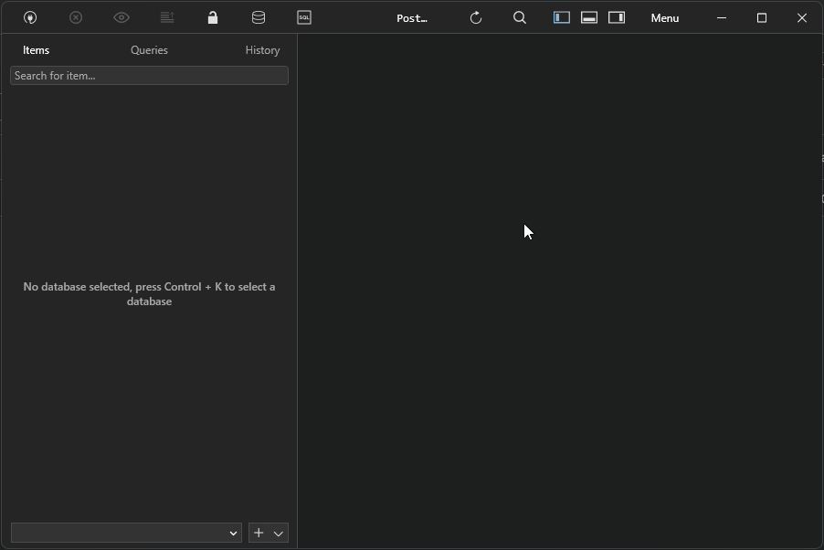

# AWS SaaS Examples

We'll talk about 3 different services today, EC2, S3, and RDS.

[EC2](#ec2) is compute engines. Headless servers made for processing data, and don't provide the same networking tools that some other services provide. This is made for data processing and has plenty of different options to different data sets.

[S3](#s3) is a storage service, similar to dropbox, onedrive, and seafile, but it's catered towards commercial use. This can be used in marketing graphics/material for anything that needs to be stored on a server, and aws can configure this to live on a CDN for some extra cash.

[RDS](#rds) (Relational Database Service) is a database solution that is fully hosted and managed by aws. There isn't much more to it.


## EC2

Start EC2 free instance with default settings.

Update system and reboot it
```
sudo apt update && sudo apt upgrade -y
sudo reboot
```

Wait for system to reboot, then install depenedencies
```
sudo apt install curl python3 git
```

Lets download some simple [python console games](https://github.com/topics/console-game?l=python) from github.


### Number Guessing Game

Install number guessing game by curling this raw github file.

```bash
curl https://raw.githubusercontent.com/Akshay-Vs/Number-Guessing-game/main/number_guessing_game.py -o number_guessing_game.py
```

Launh the game using python
```bash
python number_guessing_game.py
```

### Minsweeper console game

Start by cloning the game's full files.

```bash
git clone https://github.com/jarseneault/minesweeper
```

Run the code by executing their major file while in the program directory.

```bash
cd minesweeper
python minesweeper.py
```

## S3

Lets start by making a bucket with the following changes on the configuration screen.
- Bucket name = your WSUTech ID
- Enable ACLs
- Uncheck 'block ALL public access'
- Acknowledge public access
- Click create bucket

Once that's done, find an image off the internet and upload the file. Update these settings on the settings screen for uploading the file.
- Under Permissions
  - 'grant public-read access'
  - Acknowledge public access
- Click upload

## RDS

First, we're gonna need something to look at the database and send it commands because AWS doesn't provide that for this service. Lets download [tableplus](https://tableplus.com/)

Lets create a PostgreSQL database with the following configureation:
- Free teir
- Settings
  - DB instance Identifier = Your WSUTech ID
  - Master password = Something you will remember (unholyCabages)
- Connectivitiy
  - Public access to 'yes'
  - Create new VPC group = Your WSUTech ID

Lets setup our connection in TablePlus.


Click 'test' to make sure our connection is valid, save the connection, then click on the new server on your main menu.

Lets restore our data from the file included with this guide called 3_AWS_RDS_example.db. This is an exported database from a online faker tool.

