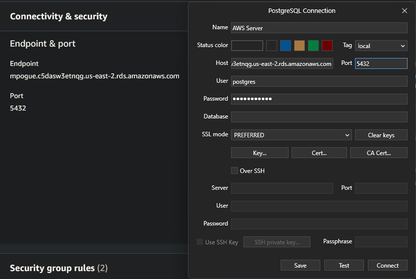

# AWS SaaS Examples

We'll talk about 2 AWS (Amazon Web Services) services today; S3 and RDS.

[S3](#s3) is a storage service, similar to dropbox, onedrive, and seafile, but it's catered towards commercial use. This can be used in marketing graphics/material for anything that needs to be stored on a server, and aws can configure this to live on a CDN for some extra cash.

[RDS](#rds) (Relational Database Service) is a database solution that is fully hosted and managed by aws. There isn't much more to it.

## Prerequisites

- Sign up for AWS using your school or personal email. If student credits are avilable, apply them to your account.
- Download [TablePlus](https://tableplus.com/). This specific application is not required, but an alternative appliation will need to restore a PostgreSQL backup.

## S3

Lets start by making a bucket with the following changes on the configuration screen.
- Bucket name = your WSUTech ID
- Enable ACLs
- Uncheck 'block ALL public access'
- Acknowledge public access
- Click create bucket

Once that's done, find an image off the internet and upload the file. Update these settings on the settings screen for uploading the file.
- Under Permissions
  - 'grant public-read access'
  - Acknowledge public access
- Click upload

## RDS

First, we're gonna need something to look at the database and send it commands because AWS doesn't provide that for this service. Lets download [tableplus](https://tableplus.com/)

Lets create a PostgreSQL database with the following configureation:
- Free teir
- Settings
  - DB instance Identifier = Your WSUTech ID
  - Master password = Something you will remember (unholyCabages)
- Connectivitiy
  - Public access to 'yes'
  - Create new VPC group = Your WSUTech ID

Lets setup our connection in TablePlus.

Click 'test' to make sure our connection is valid, save the connection, then click on the new server on your main menu.

Lets restore our data from the file included with this guide called 3_AWS_RDS_example.db. This is an exported database from a online faker tool.

