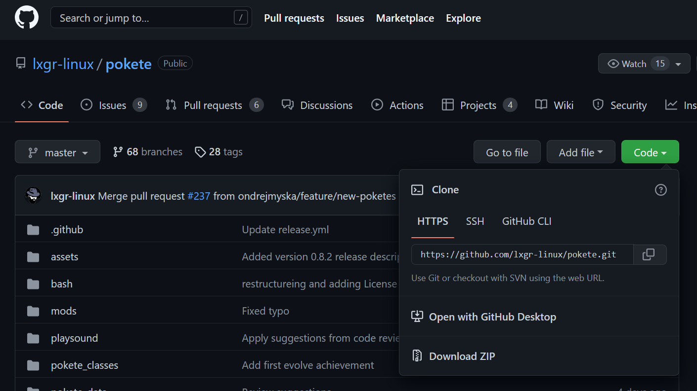
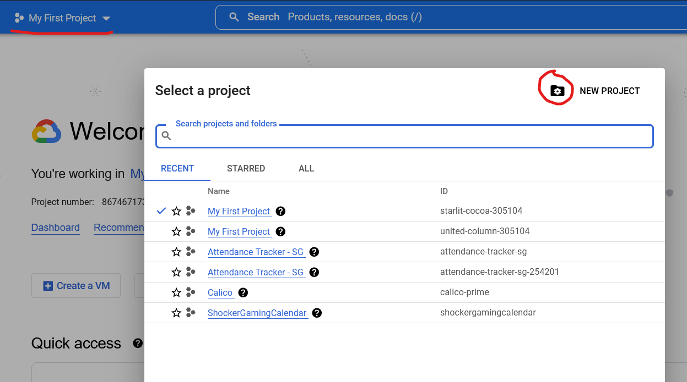

# GCP SaaS Examples

We'll talk about 2 GCP (Google Cloud Services) services today; Storage Bucket and VM's.

[Cloud Strorage](#cloud-storage) Just google's version of s3, we're visiting this to see differences.

[VM Instances](#vm-instances) (Relational Database Service) is a database solution that is fully hosted and managed by aws. There isn't much more to it.

## Prerequisites

- Sign up for GCP using your school or personal email. If student credits are avilable, apply them to your account.


## Cloud Storage

Cloud Storage works very similarly as S3, but it's interface is a little different. Today's challenge is to setup Cloud Storage with a single public image with no real guidance.

Keep in mind that if documentation is provided to you, someone took the time to write it, you should take the time to read it.

If you get stuck, ask your instructor.

## VM Instances

Create a VM instance with any name. All other settings should be default.

Once you've setup your VM, you should be able to connect by clicking the 'SSH' button either on the instances page, or when you click into the instance. This should open a terminal where you can paste the following commands one-by-one. If you want to know more about each command, ask your instructor.

Update system
```
sudo apt update && sudo apt upgrade -y
```

Install depenedencies
```
sudo apt install curl python3 python3-pip git
```

The last task of the day is to pick something from the [python console games](https://github.com/topics/console-game?l=python) list on github. Install one on the system and run it.

Below are a few hand-picked games for you to try.


### Number Guessing Game


```bash
# Install number guessing game by curling this raw github file.
curl https://raw.githubusercontent.com/Akshay-Vs/Number-Guessing-game/main/number_guessing_game.py -o number_guessing_game.py
# Launh the game using python
python3 number_guessing_game.py
```

I've found that difficulty levels above 20 work best. Good luck.

### Minsweeper console game


```bash
# Start by cloning the game's full files.
git clone https://github.com/jarseneault/minesweeper
# Run the code by executing their major file while in the program directory.
cd minesweeper
python3 minesweeper.py
```

### Pokete (Terminal-based Pokemon)

```bash
# Install program and dependencies
python3 -m pip install scrap-engine
git clone https://github.com/lxgr-linux/pokete.git
# Go into game directory and run main file
cd pokete/
python3 pokete.py
```

### Any other game

First thing is to "clone" any code from github. You can find this by clicking the "code" button on any of the github pages, and copying the provided link. It should start with "https://"



Using the link in the folling command, clone the repository code.

```bash
git clone <link>
# Where <link> is the link you copied from the github page.
```

Once you're at this step, every program is going to be different, please check the page you copied the link from for installation instructions.

If there is a `requirements.txt` file, you can run the following command to install all python requirements.

```bash
python3 -m pip install -r requirements.txt
```

## Delete your project

This whole time, you've been creating environments under a project listed in the top left corner of your screen. If this is the first time you're using GCP, it will be something like "My First Project".

To delete your project, click the down arrow where your project name is listed, select the folder with cog to manage your projects, select your project, and press delete.

