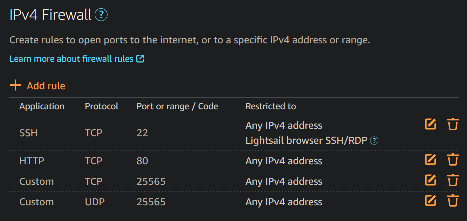

Lets setup a Lightsail instance called `MC_Server` running "Ubuntu 20.04 LTS".

Lets update our instance using apt
```bash
sudo apt update && sudo apt upgrade -y
# Kernal update requires a reboot
sudo reboot
```

Next, lets configure apt to be able to install the most recent version of OpenJDK, as it's the easiest way to get JDK right now.
```bash
sudo add-apt-repository ppa:openjdk-r/ppa; sudo apt update
sudo apt install -y openjdk-17-jdk
```

Lets check our java install
```bash
which java
# Should point to /usr/bin/java
java -version
# Should say `openjdk version "17.0.*" ...`
```

Alright, java is installed, lets grab out minecraft server
```bash
sudo mkdir /srv/minecraft-server/
sudo curl https://piston-data.mojang.com/v1/objects/f69c284232d7c7580bd89a5a4931c3581eae1378/server.jar -o minecraft_server.1.19.2.jar
java -Xmx1024M -Xms1024M -jar minecraft_server.1.19.2.jar nogui
```

You'll notice if you read this message that it wasn't us to accept a eula.
We could learn how to use vim or I could give you a one-line bash script to replace it.
```bash
sed -i 's/false/true/g' eula.txt
```

Wonderful! Now that we've finished that, we've just gotta launch the server again.

```bash
java -Xmx1024M -Xms1024M -jar minecraft_server.1.19.2.jar nogui
```

While that's waiting, we're gonna open some firewall rules so we can connect to our server.

Go to your management page for your Lightsail instance, go to your Networking tab. Add rules to allow TCP and UDP traffic to connect through port 25565, Minecraft's default communication port.



Once you're done with this and your server is finished loading, copy the public IP from the Networking page of your Instance console and direct connect to your server in the Minecraft Client!

> Disclaimer: Lightsail has quite a few working parts helping to get this server networked up. This isn't quite as simple on every cloud instance you'll run, or even running it out of your house. That's one of the benifits of using a cloud server like Lightsail.

