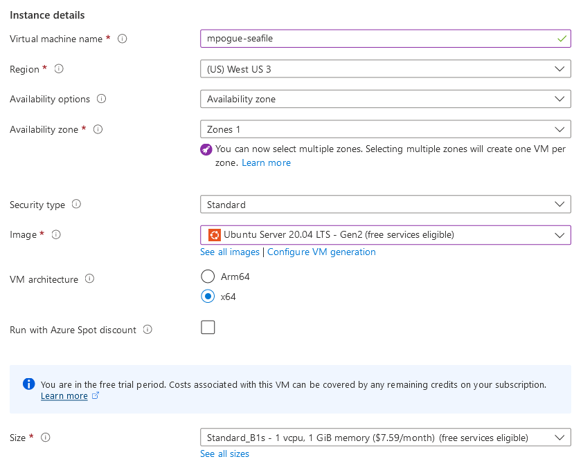
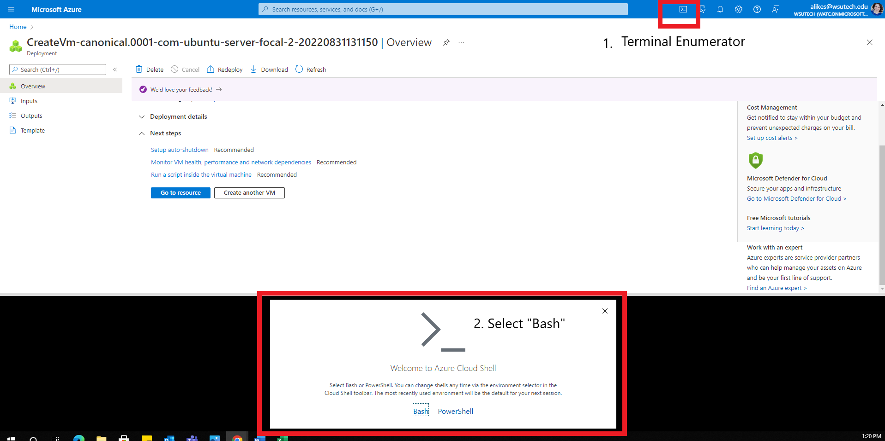
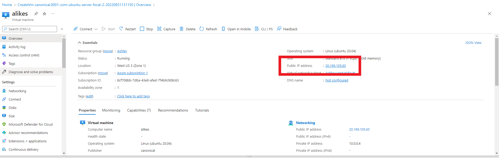

# Seafile Server

> Note for input: TO paste information, use shift+insert. This is a legacy way to paste data into terminals. If ctrl+v isn't working, you might try shift+insert.

On Azure, find and create a 'Virtual machine'. This typically can be found on the home page, otherwise you can search for it.

## VM Configuration

If you haven't used Azure before, you'll need to create a Resource Group, if you have one, you can use an empty one. The name doesn't matter.

### Instance Details
Give your VM a name that you'll remember, for this exercise I'll use my WSU Tech Email ID `mpogue`.

Make sure the rest of your details match mine.



### Administrator account

You'll need to change the only option here, as we're not using an SSH key. Click the "Password" radio selection, give the VM a username and password that you'll remember. For this expercise I'll use:

- Username: `matthew`
- Password: `unholyCabages`

### Inbound port rules

As we'll be hosting a server that serves a webpage through HTTP, we'll need to allow HTTP communication through port 80. Make sure that both 80 and 22 are open ports.

At this point, you should be able to "Review + create" and start your instance.

## Connecting

Select the terminal enumator in the top bar. When prompted for which shell to use, select "bash". Go though the rest of the steps with default settings.



While storage for your terminal is being created, find the public IP for your new Ubuntu instance by going to the network tab.



Once you have access to your terminal, you'll use the command:

```bash
ssh <user>@<host>
```

- `<user>` is your username that you setup previously.
- `<host>` is the connection string. In this case, your public IP.

> During my setup, my command looked like `ssh matthew@20.168.119.101`

## Installing seafile with the install script

Since this isn't a software class, we're gonna take the easy route. There is an install script that this guide will guide you through using to install seafile.

```bash
sudo apt update && sudo apt upgrade -y
sudo curl https://raw.githubusercontent.com/haiwen/seafile-server-installer/master/seafile-8.0_ubuntu -o seafile_install.sh
sudo bash seafile_install.sh 8.0.0
sudo rm ~/seafile_install.sh
```

Install the CE version and follow the installer instructions.

## Using Seafile

The last thing you'll need to copy to a notepad is the Admin Password. It'll print to the console once the script has finished installing.

```
  Your Seafile server is installed
  -----------------------------------------------------------------

  Server Address:      http://127.0.0.1

  Seafile Admin:       admin@seafile.local
  Admin Password:      Ohsai7oh
```

Once you're done with that, paste the public IP address, that you used to connect to the server with SSH, into your browser of choice, and use the credentials provided to login.

The admin profile will always start as `admin@seafile.local`, and if for some reason you need to view your admin password again, you can find it at `/opt/seafile/aio_seafile-server.log`

> To view the message with the log, use the command `sudo cat /opt/seafile/aio_seafile-server.log`